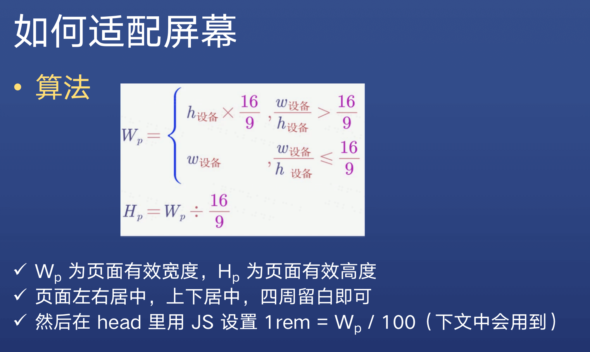
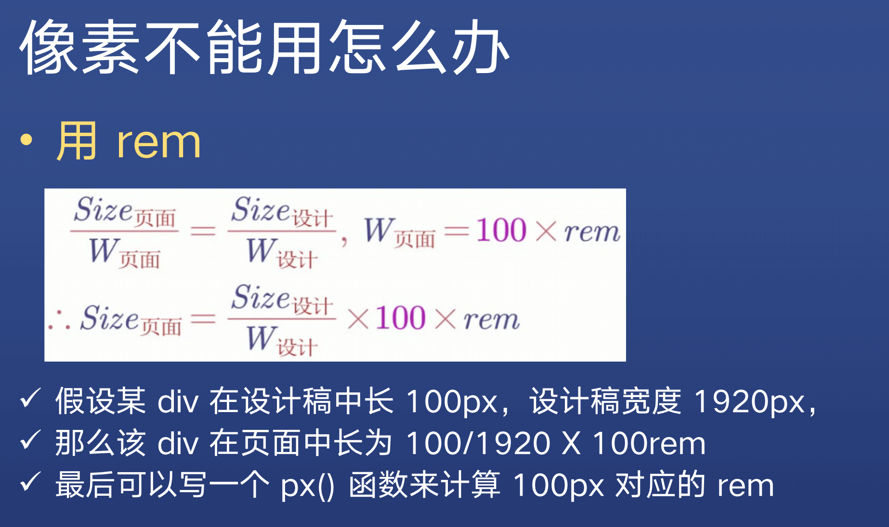

写在前面：本项目仅用于学习交流。

# 寻找素材

著名的设计网站，如： Dribbble、站酷

关键字，如：大屏、big screen、dashboard

工具，如：Photoshop、截图工具

# 适配大屏

保持页面容器元素的宽高比和设计图的宽高比一致，且始终保持页面容器元素水平、垂直居中。

# CSS单位

px无法满足我们的适配需求，需要使用 rem 单位。

# 布局

使用 Flex 和 Grid 布局。

* 理由1：大屏一般自主可控，可以使用 Chrome 浏览器
* 理由2: Grid 布局方便快捷，行、列、间隙均可自由控制

[Flex 布局教程：语法篇](http://www.ruanyifeng.com/blog/2015/07/flex-grammar.html)

[Flex 布局教程：实例篇](https://www.ruanyifeng.com/blog/2015/07/flex-examples.html)

[CSS Grid 网格布局教程](https://www.ruanyifeng.com/blog/2019/03/grid-layout-tutorial.html)